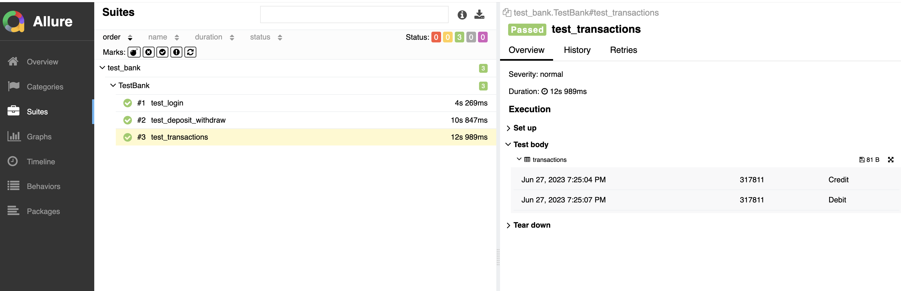

# SimbirSoft

Тестовое задание на вакансию
Разработчик в тестировании

## Установка и настройка Selenium Grid

1. Установите Java на ваш компьютер если она у вас отсутствует. Вы можете скачать Java с [официального сайта](https://www.java.com/ru/download/).

2. Скачайте файл `selenium-server-4.10.0.jar` с [официального сайта Selenium](https://www.selenium.dev/downloads/). (версия может отличаться)

3. Запустите Selenium сервер через терминал находясь в той же папке, где расположен файл `selenium-server-4.10.0.jar`, с помощью команды:
    ```
    java -jar selenium-server-4.10.0.jar hub
    ```

4. Запустите узел с помощью команды:
    ```
    java -jar selenium-server-4.10.0.jar node --detect-drivers true --grid-url http://192.168.0.13:4444
    ```
    Адрес может отличаться, смотрите ответ командной строки при запуске Selenium сервера (например, `17:23:09.635 INFO [UnboundZmqEventBus.<init>] - Connecting to tcp://192.168.0.13:4442 and tcp://192.168.0.13:4443`).

## Установка и запуск тестов

1. Скачайте репозиторий на ваш компьютер:
    ```
    git clone https://github.com/warmsnow17/simbirsoft.git
    ```

2. Перейдите в директорию проекта:
    ```
    cd simbirsoft
    ```

3. Установите все необходимые зависимости с помощью Poetry:
    ```
    poetry install
    ```

4. Запустите тесты с помощью команды:
    ```
    pytest --alluredir=./allure_results test.py
    ```

5. Запустите команду:
    ```
    allure serve ./allure_results
    ```
    Это передаст результаты тестов в Allure и перенаправит вас рабочую панель allure в браузере.

## Результаты тестирования

Результаты тестирования можно увидеть на веб-странице, которую создает Allure.


